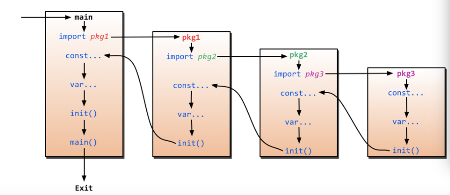

# golang
### go-lang 的数据结构是有着以下必要的东西的

* 包的声明
* 包的引入
* 程序执行的片段
* 注释

---

### 概要 

1. go 不能使用let诶，我使用es6习惯了，老是声明使用let，没办法go-lang使用的只有var, 不过**常量也是使用的const**
2. 声明的时候有这么几种
3. 有以下的方法
    - var name type ; 
    - var value = []type{}//slice
    - var value = [12]type{}//数组
    - var name type = vale; 
    - var name  = value;
    - nem := value
    - `var()`

      > 其中 := 左面的变量必须未定义，并且这种方式，跟js中也完全不同。需要适应

4. 其实go中很多知识能在js中找到共同或者类似代替品
5. 说到go中的指针，可以说亮点
6. 使用&来找到变量的内存地址
7. 使用 var name \*type 来定义一个指针变量当然如果要初始化可以

  ~~~golang
  name := 10
  var in *init
  in = &name
  ~~~

  用此方法就可以初始化一个指针变量
6. go中的结构体可以类似js中的构造函数。
  > 只是类比而已，概念不同啊！

7. go-lang中的切片可以当作是更灵活的数组，可以是动态的长度，当然例如js这种脚本的数组本来就是动态的
8. rang可以类似js中的for of
，作用是迭代，其实就是从头到尾走一遍的意思。
9. 当然类似与js中的map
10. 类型的转换 当然也是类似与js
11. interface 当然你可以类似js中的基于原型的继承，差不多啦 我指的是看上去，其实不一样 别搞错了。
12. 错误机制，其实是定义一个错误的interface接口

> 初步认识go 当然完全不知道啊什么，先类比，再知道真实的东东。初步认识就写这么多

讲解一下golang中包的引入顺序

golang中是一定需要一个main包的，当然前提是这个项目是可以自动执行，或者说是可以编译成二进制代码的项目。那么，main包中也一定需要一个main函数，还有一点，任何的包中都需要一个init内置函数。加入在main包中引入了 ftts这个包，那么ftts又需要fttssss，那么最先初始化的就是fttssss这个包，也就是说从最底层的开始引入:



**上图很明白的解释了这个流程** 也就是说，
程序先导入包，不过要从最底端的包开始导入，并且包不会导入多于一次。然后从最底端的包开始初始化包级变量和包级常量，并且执行init函数(让人如果有init的话) 然后一次往上层转，最后到了main包的main函数(main函数最后才被执行),然后结束。

---
golang中 引入的包一定是文件夹，不能单独引入一个文件。go中只接受一个文件。要记好
关于type类型我想说的是固定写法就是 type valueName typeDescriptons 
```go
//
type runType func(aap int)(int)
// 
type exampleNmae struct {
  name string
  age int
  number int
}
//
type exapleSlice []string
//
//可以结合在一起
type all struct {
  runType
  exmapleNmae
  exapleSlice
  number int
  apple string
}
```

struct 类似于js中的对象，只不过js更简单

在go中有固定用法，利用初始化的时候统一使用
var valueName typeName
命名并且初始化给初值
valueName := 
当slice初始化并且给初值市
``` golang
1. var app  = []int{1, 2, 3}// 初始化并且给初始值的时候并不需要在app后面再给定类型
var app []int // 不给定初始值就这样写就好

```
golang中指针 使用 *来表明例如 `var a  *int `就代表了一个指针指向的内容是int的一个指针类型，也就是说 a是指针。那么如果要给a初始化的话 就是 &b 要引入一个地址，(指针就是一个地址) 并且在go中 * 还指代指针的内容，例如 

```golang
func run(a *int) int {
  //这里 上面*代表初始化一个指针
  return *a + 1
  //这里代表的是指针指向的一个内容
}
当我们调用的时候我们可以
func main () {
  b := 12
 run(&b)//调用的是b的地址。也就是b的指针。
}

```
之所以调用指针，是因为指针可以改变那个初始值

然而如果只是使用的是变量，那么你只是将指进行一个复制传入而已，效率是会有影响的
goang 中会有调用指针简便方法
```golang
func name(a *int) int{
return a
}
func main() {
  b := 12
  name(b)
}

```
也就是说，只有你声明的时候必须注明是指针，你使用的时候可以省略指针，只使用变量名就好。

golang中其实有这样一种默认事实，也就是说父亲可以使用儿子的玩具，但是当父亲有自己的玩具，并且是一样的玩具的时候，他就会使用自己的。

for example：

```golang
type son struct {
  name string
  age  int
}
type mother struct {
  son
  name string
}
type father struct {
  son
  name string
}

func (a son)run () {

}
func (a father)run () {

}
a := father{son{"dawe", 1}, "da"}
b := mohter{son{"dawe", 1}, "li"}
a.run  // 因为父亲有自己的run 所以这里调用的是父亲的run
b.run //  因为母亲并没有自己的run，所以这里调用的是儿子的run这也算是一种继承
//同理当调用数据的时候 b.name a.name 指代的都是自己的name 只有 b.son.name 才是儿子的
//但是如果父亲和母亲并没有自己的name a.name就可以直接指代儿子的name。所以这个规定就是，有自//己的先使用自己的，没有自己的就看自己的儿子有没有，如果实在没有就是undefined 
```

写一点关于js和go的一点感悟：

其实就是golang实现和js同样的功能要多一点点东西例如

```javascript
let a = {
  b() {
    console.log("js")
  }
}
a.b();
```

```golang
type name struct {}
func (a name)b() {

}
b := name{}
b.b()
```
我们会发现，js中想设定a 是 b的method直接设置就好，但是在golang中是需要你先设置一个模版
也就是说 `type name struct` 这个type这个过程的。

### interface

我们谈谈什么是interface

举个例子
```javascript
const app = {
  method1(),
  method2(),
  method3(),
}
```
在js中我们如果想让一个对象有很多method是很容易实现的。只需要上文就可以实现。但是如果我们想在golang中实现这种功能就要使用interface这个method集合这个东西了
```golang
type app1 interface {
  mthod()
  mthod2()
}
```
同样的，在golang中所有的功能都是先有模版再实例。所以这个interface还要去实现这个功能。

并发 && 并行

在实现这个方面 go主要使用的是协程, 这跟nodejs使用的是不同的，其中要使用关键字 go来实现高并发/并行

使用channel 是实现同步通信的关键，使用make进行创建 `make(chan int)`要指明通信的类型

使用`<-` 来接收数据并且可以使用`value := <-v`来接受并赋值给value（这里的<-v 不要分开但是单独写的室友分开 <- v）


## Summary


---

关于指针的一些深刻的理解

```golang
func run() {
	//就说明了，通过直接操作指针，可以直接操作变量指向的那唯一的内容
	a := huamn{12, 2}
	p := &a
	p.huamn = 2222
	fmt.Print(a)
}

```
我们可以看到，我们使用了p指向了a变量的指针，通常情况下我们指向的都不是a变量，而是a变量代表的值。所以说，当使用p.huan的时候进行更改数据，就等于对a本身进行更改，并美哟复制数据。

也就是说，当使用想按照我们使用一般形式的时候，你赋值给p变量的是一个具体的值，当你使用指针，相当于你只是复制了一把🔑 ，这把钥匙就是a，你开启的是同一个门。

### golang中的切片

在golang中，slice可以切片，也就是说，
```golang
p := []int{1, 3 ,3, 4, 3}
p1 := p[1 : 3]
```
那么我们可以说，p1等于{3, 3} 也就是取头不取尾，取了1 但是没有取3 我们取的是 3 - 1
### golang中容量和长度的对比
Go语言中，切片是长度可变、容量固定的相同的元素序列。Go语言的切片本质是一个数组。容量固定是因为数组的长度是固定的，切片的容量即隐藏数组的长度。长度可变指的是在数组长度的范围内可变。

也就是说：

- 数组中 len()函数和cap()函数结果是一样的都是长度(或者说都是容量)
- 在切片slice中slice是指向的一个数组，那么slice的最大容量当然不能超过数组的长度(容量) 所以说slice 容量等于数组的长度，并且不能改变，长度是小于等于自己的容量，并且可以改变。

exapple:
```golang
a := make([]int, 5, 12)//注意5是长度 12是容量，容量是不能小于长度的。
b := a[1, cap(a)]//意思就是取最大容量。
``` 

### 关于nil

nil并不是null nil是指切片slice的零值意思是：

- 长度为0
- 容量为0

### 记得是什么是slice 其实slice是一个指向一个数组的变量。

所以说传入数组的参数都可以穿入一个slice因为你穿入了一个slice就相当于传入了它指向的数组。

### slice vs map

- map 如果对比js你可以很清楚的发现，所谓map 也就是说你之前的key 是int 现在你可以用任意的类型作为key
- slice不使用make给容量和长度也是可以的，也就是说当使用`var []T`也是可以继续给它赋值的。
- 然而 map不是，使用`var mao[t]structName`这种做法初始值是nil也就是说长度和容量都是0 但是map中使用var来制定的初始值是nil的情况无法进行后续的赋值也就是是，使用map的时候只能使用make(当然slice也可以不过slice普通var也可以map不可以罢了)

### func

```golang
a := func() {

}

```
类似于js

```javascript
let a = () => {

}
```
或者是es5中的写法
```javascript
var a = function(){

}
```

# 所以说golang是结合了编译语言的严谨和脚本语言的高效。并且最符合最新编程世界的cpu多核利用。

> golang原生支持协程，原生支持多核，支持高并发和高并行
  - 简洁
  - 语言支持多核cpu
  - 没有历史包袱
  - 开发高效
  - 运行速度超过java仅次于c 并差距不断缩小。
  - 语法严谨
  
### 函数

注意返回值，单个不需要括号，如果是多个是需要括号的。